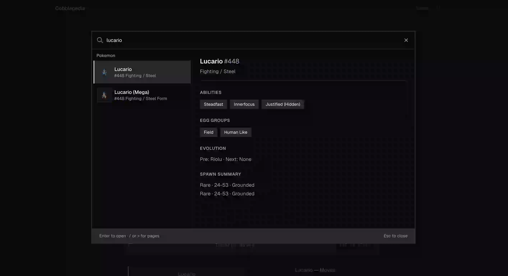
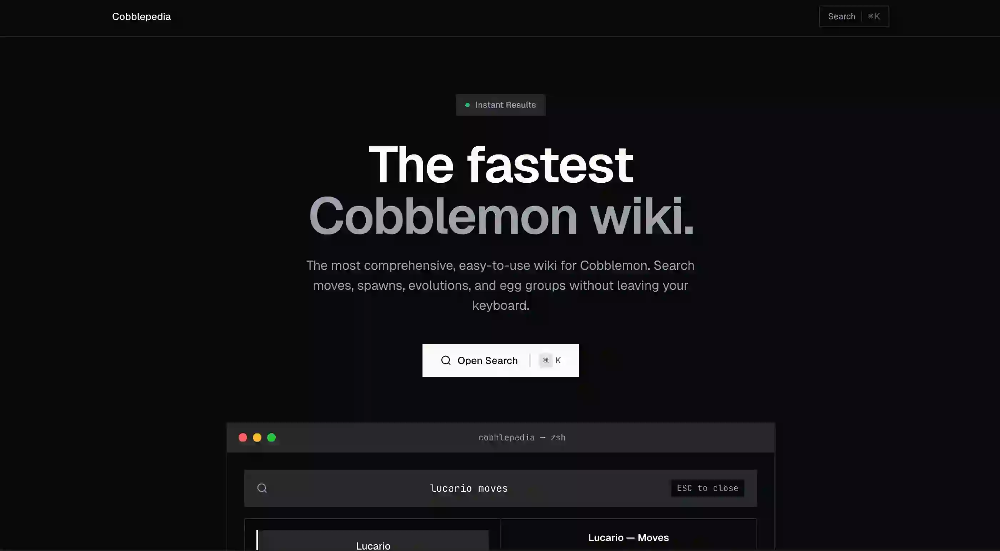
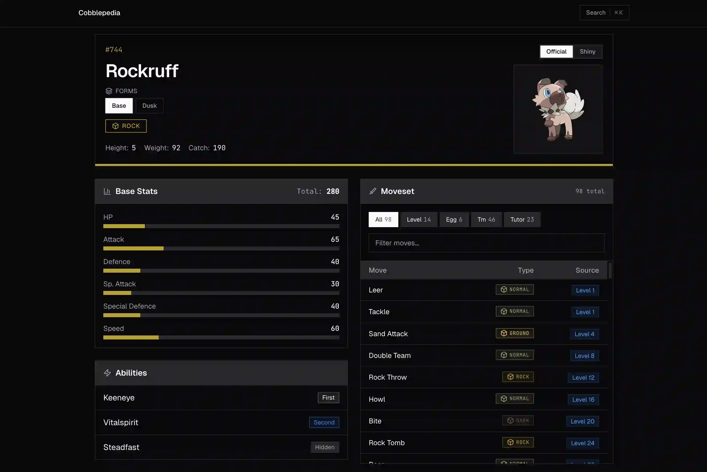
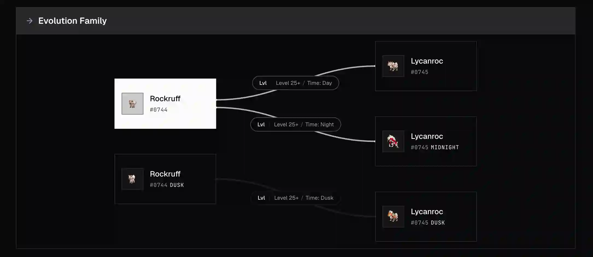

# Cobblepedia

A keyboard-first Cobblemon encyclopedia. Built for speed.

Press `Cmd+K` (or `Ctrl+K`), type `lucario moves`, hit Enter. That's it.



## What it does

Cobblepedia lets you look up Cobblemon data without clicking through menus. Type natural queries like:

- `lucario egg group` — breeding info
- `lucario moves` — full moveset with tabs
- `lucario spawn` — where to find them
- `lucario evolution` — evolution chain and methods
- `moves trickroom` — which Pokemon learn a move

Results appear instantly. No page reloads.

## Why it exists

The official [Cobbledex](https://cobbledex.info) is great for browsing. Cobblepedia is for when you already know what you want and need it fast.

## Features

- **Command palette** — Global search with `Cmd+K`
- **Smart facets** — Add `moves`, `spawn`, or `evolution` to any Pokemon query
- **Move lookup** — Find every Pokemon that learns a specific move
- **Keyboard-first** — Navigate everything without touching your mouse
- **Live previews** — Sprite and artwork from PokeAPI, 3D models from Cobblemon assets

## Tech

Vike + SolidJS + Hono, Bun, Tailwind CSS v4, FlexSearch for the index.

## Setup

```bash
# 1. Install
bun install

# 2. Clone Cobblemon source (for data generation)
git clone https://gitlab.com/cable-mc/cobblemon .tmp-cobblemon

# 3. Generate data
bun run generate:data

# 4. Start dev server
bun dev
```

Open `http://localhost:3000`.

## Screenshots

| Home | Detail Page |
|:---:|:---:|
|  |  |

| Evolution View |
|:---:|
|  |

## Credits

- Data: [Cobblemon](https://gitlab.com/cable-mc/cobblemon)
- Models: [Cobblemon Assets](https://gitlab.com/cable-mc/cobblemon-assets)
- Sprites: [PokeAPI](https://pokeapi.co)
- Inspired by: [Cobbledex](https://cobbledex.info)

Unofficial fan project. Not affiliated with Cobblemon, Mojang, Nintendo, Game Freak, or The Pokémon Company.

## License

MIT
